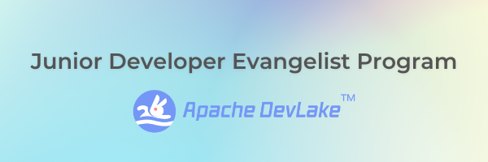

# JDE Program

# Table of Content
1. [Introduction](#introduction)
2. [Core Goals](#core-goals)
3. [Key Deliverables](#key-deliverables)

## Introduction
The DevLake Junior Developer Evangelist program is a more advanced and focused type of internship program, dedicated to growing and evolving our open-source presence and community for [Apache DevLake (incubating)](https://devlake.apache.org/). 

The program will last three (3) months for the first rotation, and will require a once per week 45 minute team huddle (TBD time/day based on time-zones and cohort availabilities), and approximately eight (8) hours per week of effort/work/deliverables.

Upon successful completion of the program, the participants will be provided a certificate and letter of completion, as well as a recommendation letter. Furthermore, successful candidates might be invited to continue on in their role in a part-time, full-time, or consulting capacity upon mutual agreement. 

For DevLake, this program will support the continued growth and development of the project and community by expanding content, visibility, and documentation. 

## Core Goals

- Grow DevLake Adoption/Implementation in Open-Source Projects (Seed/Pilot Users) 
- Advance DevLake Use-Cases (Discovery & Community Development) 
- Expand DevLake Community (Stars, Forks, Contributors, & General Members) 
- Enhance DevLake Usability (Documentation, Demos, & Tutorials)

## Key Deliverables
The program participants will commit to a three (3) month rotation where they will accomplish the following five key deliverables: [Final requirements/deliverables TBD]

### Content
Creating content (blog posts, videos, meetups, tutorials, documentation, conference talks) supporting and evangelizing DevLake. 
- Produce 3x blogs in support of DevLake. Few content types that can be explored:
  - Types of content [here](Content/README.md)
- Recruit 3x guest blogs/interviews in support of DevLake.
- Produce 2x documentation pieces. 
- Produce 1x instructional / demo video. 

#### **Submit the content [here](Content/README.md)**

Check `Content/README.md` for more information
### Community
Growing, nurturing, and supporting our growing base of adoptions, contributors, and awareness.
- Recruit 1x guest-blogger (OSS Leaders, Maintainers, Community leaders.)
- Connect 2x open-source projects to DevLake team.
- Present (casual presentation/discussion) at 1x weekly community huddle (topic/focus TBD with Maxim)

### Product
- Building and improving the developer experience, understanding different users (students, early developers, DevOps, Engineering leaders, CTOs, etc.) and translating those to dashboards, case studies, and more.
- Create a 2x Hackathon Dashboard for participants and organizers. (Team activity)

Check `Dashboard/README.md` for more information

### Outreach
- Participate / Post in 1x thread/forum/discussion per week (on pre-approved forum/platform) 
Events
Includes hosting, participating and collaborating in events, podcasts, regular engagement to activate the community.
- Attend 2x community events. 
- Host 1x community event/meetup/zoom/huddle/AMA etc.

Check `Outreach/README.md` for more information

**The positive result of all these specific goals will be more brand awareness, more adoption, and more growth for DevLake on other measures (Stars, Clones, Forks, etc.)**

